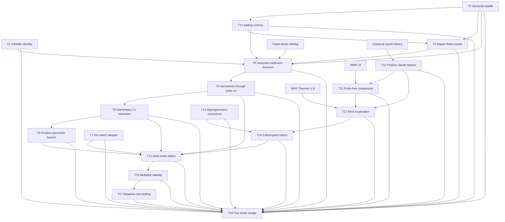

# Phase 25 proof dependency graph

Date: 2026-08-17
Machine-readable source: `PROOF_DEPENDENCY_GRAPH.json`

## Critical cut sets

- **Analytic cut:** T1--T6. This is the largest remaining conventional
  complex-analysis surface.
- **Parameter cut:** T8--T9. Phase C and Phase E target its remaining finite
  formalization gaps.
- **External root-theory cut:** T10--T12. Phase F targets the exact adapters
  and narrow special cases rather than recreating all of MMP/MSS.
- **Recurrence cut:** T13--T14. Phase D makes the terminating polynomial the
  Lean source of the recurrence.
- **Interpolation layer:** closed in Phase B. Lean derives the exact six-node
  Newton factorization and `M/720` estimate on an open convex analytic domain,
  with a separate convex bound set. Hermite--Genocchi is therefore not an
  external logical input. T15 remains amber only through its upstream analytic
  and parameter dependencies.
- **Kernel-checked tail:** T16--T17 and the conditional assembly in T18.

The headline theorem cannot be advertised as end-to-end Lean checked until
the xi coefficient sequence constructs the concrete certificate consumed by
T18. Phase I is a bounded feasibility study, not a promise to close the full
analytic cut.
